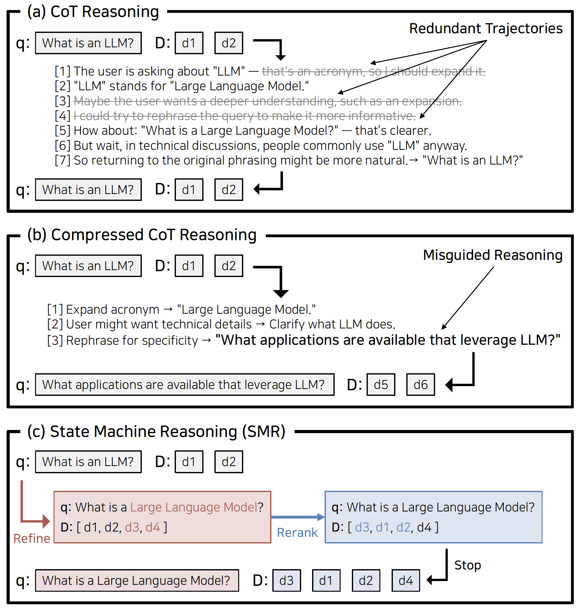
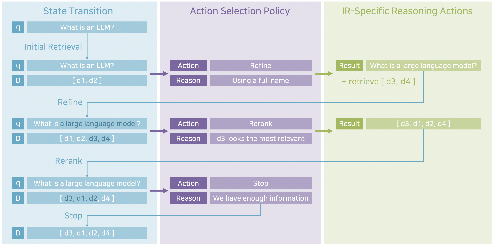

# 🔄 From Token to Action: State Machine Reasoning (SMR)

[](https://github.com/ldilab/SMR)  
[](https://arxiv.org/abs/2505.23059v1)

## 🤔 What is SMR?

State Machine Reasoning (SMR) is a lightweight framework that replaces token-level Chain-of-Thought (CoT) traces with three discrete, IR-focused actions—REFINE, RERANK, and STOP—to prevent overthinking in retrieval.

### 🎯 Existing Challenges

Token-based CoT often leads to:

<p align="center">
  
  <br>
  <em>Figure 1: (a) Standard CoT, (b) Compressed CoT, (c) SMR.</em>
</p>

1. **Redundancy**  
   - Repeatedly paraphrases without new retrieval gains.
2. **Drift**  
   - Compression may alter the query’s original intent.

### 🔍 Causes of Overthinking

- **Token-Level Decoding**:  
  LLMs generate each token in sequence, causing repeated or off-track reasoning.
- **No Early Validation**:  
  CoT lacks a mechanism to check if a reasoning step actually improves retrieval.

---

## 🚀 Our Solution: SMR Overview

SMR treats retrieval as a sequence of **state transitions** \((q_t, D_t)\):
- \(q_t\) = current query  
- \(D_t\) = top-k documents  

At each step, SMR’s prompt-based LLM selects one of three actions:
1. **REFINE**: Update the query to add or clarify terms.  
2. **RERANK**: Reorder retrieved documents to surface more relevant passages.  
3. **STOP**: End reasoning when no further improvements occur.

<p align="center">
  
  <br>
  <em>Figure 2: SMR’s state transitions (REFINE, RERANK, STOP).</em>
</p>

### ✨ Key Advantages

- **Fewer Tokens**  
  - Actions operate on states, not long token streams.  
  - Reasoning stops as soon as no new documents or query changes appear.

- **Effective Steps**  
  - Each REFINE or RERANK directly boosts retrieval quality.  
  - No task-specific tuning needed—SMR works with any retriever or LLM.

- **Clear Control**  
  - The LLM explains each action choice for interpretability.  
  - A maximum step limit (e.g., 16) bounds inference cost.

---

SMR cuts redundant and off-track reasoning by modeling retrieval as a state machine of \((q, D)\) states, guided by explicit IR actions. This yields improved retrieval and lower token usage compared to traditional CoT methods.


## 🛠️ Setup

1. Create a virtual environment  
   ```bash
   conda create -n smr -c anaconda python=3.12.2
   conda activate smr
   conda install -c conda-forge openjdk=21 maven -y
   pip install -r requirements.txt
   ```
2. Install Ollama
    ```bash
    apt-get update
    apt-get install pciutils udev lshw
    curl -fsSL https://ollama.com/install.sh | sh
    ollama serve
    ```
3. Pull required models
    ```bash
    # e.g. ollama pull qwen2.5:32b-instruct-q4_K_M
    ollama pull {your_model}
    ```

## ⚡ Quick Start

### Run the full pipeline
```bash
bash main.sh
```
This command downloads the BRIGHT dataset and performs inference from start to finish.

### Explaination for some arguments
```bash
MODEL=bm25                              # 1st-stage retriever
cache_dir=cache                         # path to cache directory
agent=qwen2.5:32b-instruct-q4_K_M       # Ollama LLM model
agent_tokenizer=Qwen/Qwen2.5-32B-Instruct # Hugging Face tokenizer path

for TASK in biology earth_science economics psychology robotics stackoverflow sustainable_living leetcode pony aops theoremqa_theorems theoremqa_questions; do
    python main.py \
        --task $TASK \
        --model $MODEL \
        --output_dir output/${MODEL} \
        --cache_dir ${cache_dir} \
        --agent $agent \
        --agent_tokenizer $agent_tokenizer
done
```

- **MODEL**: First-stage retriever to use
- **cache_dir**: Directory for caching data
- **agent**: Ollama LLM model identifier
- **agent_tokenizer**: Hugging Face tokenizer path (for token count)

## 📝 Citation

If you find our work useful, please consider citing our paper:
```bibtex
@article{lee2025state,
  title={From Token to Action: State Machine Reasoning to Mitigate Overthinking in Information Retrieval},
  author={Lee, Dohyeon and Jeong, Yeonseok and Hwang, Seung-won},
  journal={arXiv preprint arXiv:2505.23059},
  year={2025}
}
```
## 📦 References

We also referenced the ReasonIR code from [facebookresearch/ReasonIR](https://github.com/facebookresearch/ReasonIR).